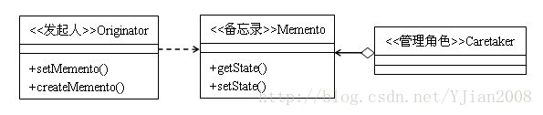

一、定义
      备忘录模式(Memento)的作用是保存对象的内部状态，并在需要的时候（undo/rollback）恢复对象以前的状态。在不破坏封装性的前提下，捕获一个对象的内部状态，并在该对象之外保存这个状态，这样就可以在需要的时候将该对象恢复到原先保存的状态。
二、结构图

       涉及的角色：发起人(Originator)角色、备忘录(Memento)角色、负责人(Caretaker)角色。
       发起人(Originator)角色：负责创建一个备忘录Memento对象，用以存储当前时刻Originator自己的内部状态，Originator可以根据需要决定将自己的哪些状态信息存储在Memento对象中，并可使用备忘录恢复内部状态；
      备忘录(Memento)角色：负责存储Originator对象的内部状态，并可以防止Originator以外的其他对象访问备忘录。备忘录有两个接口：Caretaker只能看到备忘录的窄接口，它只能将备忘录对象传递给其他对象。Originator却可看到备忘录的宽接口，这个接口允许它读取所有的数据，以便根据这些数据回复这个发起人的内部状态；
       负责人(Caretaker)角色：责在适当的时间保存/恢复Originator对象的状态，不检查备忘录对象的内容。
三、程序实例
//发起者类
```java
public class Originator {
	private String state;

	public String getState() {
		return state;
	}

	public void setState(String state) {
		this.state = state;
	}

	public Memento createMemento() {
		return new Memento(this.state);
	}

	public void cancelMemento(Memento memento) {
		this.setState(memento.getState());
	}
}
```
```java
//备忘录类
public class Memento {
	private String state;

	public Memento(String state) {
		this.state = state;
	}

	public String getState() {
		return state;
	}
}```
```java
//管理这类
public class Caretaker {
	private Memento memento;

	public Memento getMemento() {
		return memento;
	}

	public void setMemento(Memento memento) {
		this.memento = memento;
	}
}
```
```java
//测试类
public class MementoTest {

	public static void main(String[] args) {
		Originator originator = new Originator();
		originator.setState("状态1");
		System.out.println("初始状态:" + originator.getState());
		//创建一个管理者
		Caretaker caretaker = new Caretaker();
		// 将originator的状态1保存在备忘录中
		caretaker.setMemento(originator.createMemento());
		// 改变originator的状态
		originator.setState("状态2");
		System.out.println("改变后状态:" + originator.getState());
		//撤销上一步的修改动作。恢复到第一步的状态
		originator.cancelMemento(caretaker.getMemento());
		System.out.println("恢复后状态:" + originator.getState());
	}
}
```
测试结果：
初始状态:状态1
改变后状态:状态2
恢复后状态:状态1
       代码演示了一个单状态单备份的例子，逻辑非常简单：Originator类中的state变量需要备份，以便在需要的时候恢复；Memento类中，也有一个state变量，用来存储Originator类中state变量的临时状态；而Caretaker类就是用来管理备忘录类的，用来向备忘录对象中写入状态或者取回状态。
四、应用场景
      1、备忘录模式比较适用功能比较复杂，需要维护或者记录属性历史的类，或者需要保存的属性是众多属性中的很小部分，Originator可以根据保存的Memento信息还原到前一状态；
      2、如果在程序的使用到命令模式的撤销功能，那么可以用备忘录模式存储可撤销操作的状态；
      3、当角色的状态改变时，有可能这个状态无效，这个时候可以使用暂时存储的Memento将状态复原。
五、优缺点
      优点：①有时一些发起人对象的内部信息必须保存在发起人对象以外的地方，但是必须要由发起人对象自己读取，这时，使用备忘录模式可以把复杂的发起人内部信息对其他的对象屏蔽起来，从而可以恰当地保持封装的边界。②本模式简化了发起人类，发起人不再需要管理和保存其内部状态的一个个版本，客户端可以自行管理他们所需要的这些状态的版本；③当发起人角色的状态改变的时候，有可能这个状态无效，这时候就可以使用暂时存储起来的备忘录将状态复原。
     缺点：①如果发起人角色的状态需要完整地存储到备忘录对象中，那么在资源消耗上面备忘录对象会很昂贵。②当负责人角色将一个备忘录 存储起来的时候，负责人可能并不知道这个状态会占用多大的存储空间，从而无法提醒用户一个操作是否很昂贵；③当发起人角色的状态改变的时候，有可能这个协议无效。如果状态改变的成功率不高的话，不如采取“假如”协议模式。

转载一个备忘录模式的实现方法
一、定义：备忘录(memento)模式又叫快照(snapshot)模式或者token模式，主要功能：
备忘录模式是用一个对象来存储另外一个对象的内部状态的快照，实现备忘录模式的关键点是在不破坏封装的
情况下，将一个对象的状态捕捉住，并外部化，存储起来，从而可以在合适的时候，把这个对象还原。
说明：备忘录模式适模式中比较好理解的一个，这里就不举例子，但是备忘录模式是模式中实现比较难，或者说
实现比较巧的，这里主要说说。
二、备忘录模式的实现
1,备忘录模式中的角色
发起人：创建含有内部状态的备忘录对象，并使用备忘录对象存储状态
负责人：负责人保存备忘录对象，但不检查备忘录对象的内容
备忘录：备忘录对象将发起人对象的内部状态存起来，并保正其内容不被发起人对象之外的对象像读取
注意：在备忘录的角色中，定义了他必须对不同的人提供不同的接口，对发起人提供宽接口，对其它任何人提供窄
接口。也许你说我都提供宽接口得了。对这也是备忘录的一种实现，叫做白箱备忘录，不过这种方法的封装没有设计
好，安全性不够好。
2,白箱备忘录的实现：
 
白箱的优点：实现简单
白箱的缺点：上边说了，破坏了封装，安全性有些问题。
说明：这里白箱的实现只保存了一个状态，其实是可以保存多个状态的。
3，双接口的实现，宽窄接口（黑箱)
如何实现宽窄接口呢，内部类也许是个好方法。我们把备忘录类设计"成发起人"的内部类，但这样还有的问题是同一
package中的其它类也能访问到，为了解决这个问题，我们可以把"备忘录"的方法设计成私有的方法，这样就
可以保正封装，又保正发起人能访问到。实现如下：
定义窄接口.
 
ok，实现了对大多数人实现比较窄的接口，对Originator实现了宽接口.
三,最后的一些说明：
1，前边两个例子都是记录了单个状态(单check点)，要实现多个状态点很容易，只须要把记录state的字符串换
成一个list，然後添加，取得。如果须要随机须得状态点，也可以用map来存放.这样多个check点就实现了。
2，一般情况下可以扩展负责人的功能，让负责人的功能更强大，从而让客户端的操做更少些。解放客户端。
3，自述历史模式，这个就是把发起人，负责人写在一个类中，平时的应用中这种方法比较常见。
 