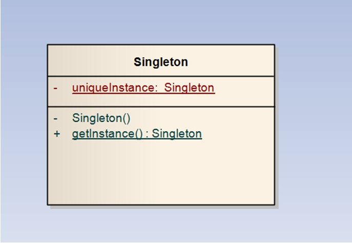
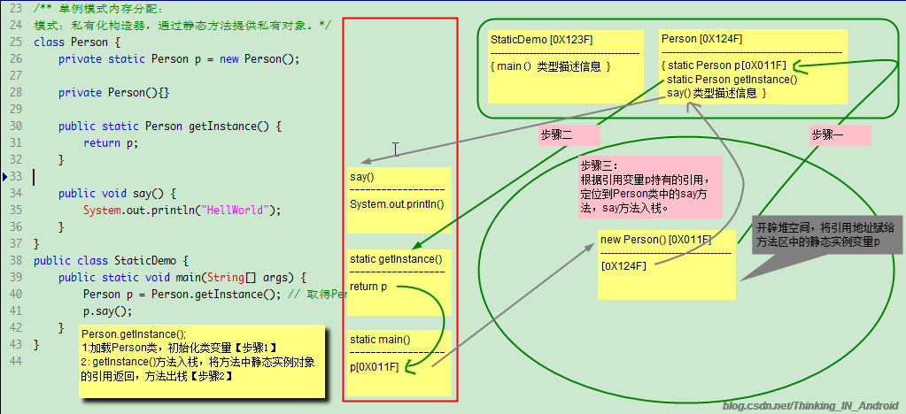

# 单例模式
 单例模式主要有三个部分：
         1.私有构造方法：防止外部实例化，只有内部可以实例化
         2.有一全局静态方法：
               (1).可以访问私有的构造方法进行实例化。
               (2).外部调用静态方法，如果存在singleton实例就返回，如果不存在则创建一个实例.自己进行对实例进行管理.
         3.静态变量：利用一个静态变量来记录Singleton的唯一实例。


### 懒汉式
```java
public class Singleton{
	
	//利用一个静态变量来记录Singleton类的唯一实例
	private static Singleton uiqueInstance;
	
	//把构造函数声明为私有的，外部不可以实例化，只有内部可以实例化
	private Singleton(){
		
	}
	
	//外部通过调用静态方法getInstance()，来获得实例化对象	
	public static Singleton getInstance(){
		//内部自己管理实例，始终保证只有一个实例
		  
		if(uniqueInstance == null) {
			//如果没有实例，则创建实例，在类的内部可以访问构造函数，进而实例化
			uniqueInstance = new Singleton();
		} 
		//如果已经存在就直接将实例返回就行了
		return uniqueInstance；
	}
}
```

### 饿汉式
```java
/**
 * 饿汉式单例模式:在类被加载的时候，唯一实例已经被创建
 */
public class HungrySingleton {
	public static final HungrySingleton singleton = new HungrySingleton();
	private HungrySingleton(){}	//私有构造方法,避免外部创建实例
	
	public static HungrySingleton getInstance(){
		return singleton;
	}
}
// ----------------
/** 
 * 通用的饿汉式单例模式 ,解决多线程访问的问题
 */ 
public class SingletonPattern {
	private static final SingletonPattern singletonPattern = new SingletonPattern();
	
	private SingletonPattern(){}//私有构造方法,避免外部创建实例
	
	public static synchronized SingletonPattern getInstance(){
		return singletonPattern;
	}
}
```
### 懒汉式
```java
/**
 * 懒汉单例模式:只有在第一次请求实例的时候的时候创建，并且只在第一次创建后，以后不再创建该类的实例。
 */
public class LazySingleton {
	private static LazySingleton singleton = null;
	private LazySingleton(){}	//私有构造方法,避免外部创建实例
	public static LazySingleton getInstance(){
		if(singleton == null){
			singleton = new LazySingleton();
		}
		return singleton;
	}
}
/// ------------

/** 
 * 通用的懒汉式单例模式 ,解决多线程访问的问题
 */ 
public class SingletonPattern {
	private static SingletonPattern singletonPattern = null;
	
	private SingletonPattern(){}//私有构造方法,避免外部创建实例
	
	public static synchronized SingletonPattern getInstance(){
		if(singletonPattern == null){
			singletonPattern = new SingletonPattern();
		}
		return singletonPattern;
	}
}
```

### 登陆式单例
```java
import java.util.HashMap;
import java.util.Map;

/**
 * 登记式单例实际上维护的是一组单例类的实例,将这些实例存放在一个Map（登记薄）中,对于已经登记过的实例，
 * 则从工厂直接返回,对于没有登记的,则先登记,而后返回.
 * 登记式单例类是为了克服饿汉式单例类及懒汉式单例类均不可继承的缺点而设计的.当单例类需要被继承时适用.
 */
public class RegisterSingleton {
	private static Map<String, RegisterSingleton> map = new HashMap<String, RegisterSingleton>();
	static {
		RegisterSingleton singleton = new RegisterSingleton();
		map.put(singleton.getClass().getName(), singleton);
	}

	protected RegisterSingleton() {}// 受保护的构造函数

	public static RegisterSingleton getInstance(String name) {
		if (name == null) {
			name = RegisterSingleton.class.getName();
			System.out.println(name);
		}
		if (map.get(name) == null) {
			try {
				map.put(name, (RegisterSingleton) Class.forName(name)
						.newInstance());
			} catch (Exception e) {
				e.printStackTrace();
			}
		}
		return map.get(name);
	}
}
//---------------------------
package pattern.singleton;

public class RegisterSingletonChild extends RegisterSingleton{
	
	public static RegisterSingletonChild getInstance(){
		return (RegisterSingletonChild)RegisterSingleton.getInstance("pattern.singleton.RegisterSingletonChild");
	}
	
	public static void main(String[] args) {
		RegisterSingletonChild.getInstance();
		RegisterSingleton.getInstance("pattern.singleton.RegisterSingletonChild");
	}
}
````

```java
 
public class SingletonClass {

  private static SingletonClass instance = null;

  public static SingletonClass getInstance() {
    if (instance == null) {
      synchronized (SingletonClass.class) {
        if (instance == null) {
          instance = new SingletonClass();
        }
      }
    }
    return instance;
  }

  private SingletonClass() {

  }

    /*
    还有问题吗？首先判断instance是不是为null，如果为null，加锁初始化；如果不为null，直接返回instance。
 
    这就是double-checked locking设计实现单例模式。到此为止，一切都很完美。我们用一种很聪明的方式实现了单例模式。
    */
}
```

 
5. 从源头检查

 
下面我们开始说编译原理。所谓编译，就是把源代码“翻译”成目标代码——大多数是指机器代码——的过程。针对Java，它的目标代码不是本地机器代码，而是虚拟机代码。编译原理里面有一个很重要的内容是编译器优化。所谓编译器优化是指，在不改变原来语义的情况下，通过调整语句顺序，来让程序运行的更快。这个过程成为reorder。
 
要知道，JVM只是一个标准，并不是实现。JVM中并没有规定有关编译器优化的内容，也就是说，JVM实现可以自由的进行编译器优化。
 
下面来想一下，创建一个变量需要哪些步骤呢？一个是申请一块内存，调用构造方法进行初始化操作，另一个是分配一个指针指向这块内存。这两个操作谁在前谁在后呢？JVM规范并没有规定。那么就存在这么一种情况，JVM是先开辟出一块内存，然后把指针指向这块内存，最后调用构造方法进行初始化。
 
下面我们来考虑这么一种情况：线程A开始创建SingletonClass的实例，此时线程B调用了getInstance()方法，首先判断instance是否为null。按照我们上面所说的内存模型，A已经把instance指向了那块内存，只是还没有调用构造方法，因此B检测到instance不为null，于是直接把instance返回了——问题出现了，尽管instance不为null，但它并没有构造完成，就像一套房子已经给了你钥匙，但你并不能住进去，因为里面还没有收拾。此时，如果B在A将instance构造完成之前就是用了这个实例，程序就会出现错误了！
 
于是，我们想到了下面的代码：
 ```java
public class SingletonClass {

  private static SingletonClass instance = null;

  public static SingletonClass getInstance() {
    if (instance == null) {
      SingletonClass sc;
      synchronized (SingletonClass.class) {
        sc = instance;
        if (sc == null) {
          synchronized (SingletonClass.class) {
            if(sc == null) {
              sc = new SingletonClass();
            }
          }
          instance = sc;
        }
      }
    }
    return instance;
  }

  private SingletonClass() {

  }
    
}```

 
我们在第一个同步块里面创建一个临时变量，然后使用这个临时变量进行对象的创建，并且在最后把instance指针临时变量的内存空间。写出这种代码基于以下思想，即synchronized会起到一个代码屏蔽的作用，同步块里面的代码和外部的代码没有联系。因此，在外部的同步块里面对临时变量sc进行操作并不影响instance，所以外部类在instance=sc;之前检测instance的时候，结果instance依然是null。
 
不过，这种想法完全是错误的！同步块的释放保证在此之前——也就是同步块里面——的操作必须完成，但是并不保证同步块之后的操作不能因编译器优化而调换到同步块结束之前进行。因此，编译器完全可以把instance=sc;这句移到内部同步块里面执行。这样，程序又是错误的了！
 
6. 解决方案

 
说了这么多，难道单例没有办法在Java中实现吗？其实不然！
 
在JDK 5之后，Java使用了新的内存模型。volatile关键字有了明确的语义——在JDK1.5之前，volatile是个关键字，但是并没有明确的规定其用途——被volatile修饰的写变量不能和之前的读写代码调整，读变量不能和之后的读写代码调整！因此，只要我们简单的把instance加上volatile关键字就可以了。
```java 
public class SingletonClass {

  private volatile static SingletonClass instance = null;

  public static SingletonClass getInstance() {
    if (instance == null) {
      synchronized (SingletonClass.class) {
        if(instance == null) {
          instance = new SingletonClass();
        }
      }
    }
    return instance;
  }

  private SingletonClass() {

  }
    
}```

 推荐方法：

然而，这只是JDK1.5之后的Java的解决方案，那之前版本呢？其实，还有另外的一种解决方案，并不会受到Java版本的影响：
 ```java
public class SingletonClass {
    
  private static class SingletonClassInstance {
    private static final SingletonClass instance = new SingletonClass();
  }

  public static SingletonClass getInstance() {
    return SingletonClassInstance.instance;
  }

  private SingletonClass() {

  }
    
}
```

在这一版本的单例模式实现代码中，我们使用了Java的静态内部类。这一技术是被JVM明确说明了的，因此不存在任何二义性。在这段代码中，因为SingletonClass没有static的属性，因此并不会被初始化。直到调用getInstance()的时候，会首先加载SingletonClassInstance类，这个类有一个static的SingletonClass实例，因此需要调用SingletonClass的构造方法，然后getInstance()将把这个内部类的instance返回给使用者。由于这个instance是static的，因此并不会构造多次。
 
由于SingletonClassInstance是私有静态内部类，所以不会被其他类知道，同样，static语义也要求不会有多个实例存在。并且，JSL规范定义，类的构造必须是原子性的，非并发的，因此不需要加同步块。同样，由于这个构造是并发的，所以getInstance()也并不需要加同步。
 
至此，我们完整的了解了单例模式在Java语言中的时候，提出了两种解决方案。个人偏向于第二种，并且Effiective Java也推荐的这种方式。



1. 虚拟机加载StaticDemo类，保存类型信息到方法区。

2. 通过保存在方法区的字节码，虚拟机开始main方法，main方法入栈。

3：进入main方法第一条指令， Person.getInstance(); 首先虚拟机加载Person类到方法区，然后完成对Person类的初始化操作。
疑问来了，类变量不是保存在方法区吗?图中的私有实例对象为什么保存在堆区呢？那就要来了解一下类的初始化过程了，过程如下：
1：装载，通过类的全名产生对应类的二进制数据流，分析二进制数据流并转换为方法区特定的数据结构，创建对应类的java.lang.Class实例。
2：链接，
	分为检测（确保被导入类型的正确性。），
	准备（为类变量分配内存，并将其初始化为默认值），
	解析（把类型中的符号引用转换成直接引用）三步。
3：初始化，把类变量(static)初始化为正确初始值。
	类变量的初始化(有赋值操作)，无论是基本数据类型还是引用数据类型，类变量的初始化都会被提取到clinit方法中。
	常量的初始化，对于基本数据类型来说，会直接被编译器生成constant值。而对于引用数据类型常量的初始化会被提取到clinit方法中。
步骤3初始化是把类变量初始化为正确初始值，我们现在初始化的是实例对象，只要是new操作，都会在堆区分配空间。

4：调用getInstance()方法，方法返回实例对象的引用，getInstance()方法执行完毕出栈，程序回到main方法。

5：调用say()方法，根据引用变量p持有的引用，在堆中找到实例对象，根据实例对象持有的本来在方法区的引用，找到本类的类型信息，定位到say()方法。say()方法入栈，开始执行其中的字节码。

6：say()方法执行完毕出栈，程序回到main方法，main方法执行完毕出栈，主线程消亡。虚拟机实例消亡。程序结束。

总结：单例模式的实现，new操作依旧是在堆中为实例对象分配空间，然后在方法区保存共享实例引用。为什么说静态变量(类变量)的生命周期跟类一样呢？
这是因为实例对象的引用在方法区保存，除非类被卸载了，该实例对象才不会被引用了，然后被GC回收。否则，一直都在。
引用类型变量是静态的，对象不是静态的，我们在程序传递的都是引用，永远不会直接操作对象。

## 案例

```java
/**
 *  A test for SingletonA
 */
public class TestA  {
    public static void main(String[] args) {
        // Can not create a instance !
        //SingletonA instance1 = new SingletonA();  
        SingletonA instance2 = SingletonA.getInstance();
        if(instance2 != null) {
            instance2.setNum();
            System.out.println("i is:" + instance2.getNum());
        }
        SingletonA instance3 = SingletonA.getInstance();
        if(instance3 == null) {
            System.out.println("Can not get instance twice !");   
        }
    }
}
```

```java
/**
 *  Test for our Singleton registry
 */
public class TestB  {
    public static void main(String[] args) {
        // First we get a instance from SingletonB
        SingletonB instance1 = SingletonB.GetInstance("Sub1");
        if(instance1 == null) {
            System.out.println("There is no such instance in registry !");
        } else {
            System.out.println(instance1.getClass());
        }
        
        // Then we register a new instance
        try {
            SingletonB instance2 = new SubSingletonB();
            System.out.println("We had created a new instance named \"Sub1\" now");
        } catch (SingletonException e) {
            System.out.println(e.getMessage());
        }
        
        // To get instance again
        instance1 = SingletonB.GetInstance("Sub1");
        if(instance1 == null) {
            System.out.println("There is no such instance in registry !");
        } else {
            System.out.println(instance1.getClass());
        }

        // Finally we create a new instance again
        try {
            SingletonB instance3 = new SubSingletonB();
            System.out.println("We had created a new instance named \"Sub1\" now");
        } catch (SingletonException e) {
            System.out.println(e.getMessage());
        }
        
    }
}
```

```java
/**
 *  A new Singleton use registry
 */
import java.util.*;

public class SingletonB  {
    static private Hashtable registry = new Hashtable();
    //static private SingletonB instance;
    
    public static void Register(String name, SingletonB aInstance) {
        registry.put(name, aInstance);
    }
    public static SingletonB GetInstance(String name) {
        return LookUp(name);
    }
    
    protected static SingletonB LookUp(String name) {
        return (SingletonB)registry.get(name);
    }
}
```
```java
/**
 *  A real Singleton we want to have
 */
public class SubSingletonB extends SingletonB {
    public static boolean instanceFlag = false; //true if 1 instance
    //private int i = 0;
    
    public SubSingletonB() throws SingletonExecption {
        if(instanceFlag) {
            throw new SingletonExecption("Only can create a instance !");
        } else {
            instanceFlag = true;
            super.Register("Sub1", this);
        }
    }
    
    public void finalize() {
        instanceFlag = false;
    }
}
```
```java
/**
 *  A user defined exception
 */
public class SingletonException extends RuntimeException {
    public SingletonException() {
        super();
    }
    
    public SingletonException(String s) {
        super(s);
    }
    
}
```
```java
/**
 *  A Singleton , we can only create one instance
 */
public class SingletonA  {
    public static boolean instanceFlag = false; //true if 1 instance
    //private SingletonA instance;
    private int i = 0;
    
    // Set constructor private and do nothing
    // Can not new a instance outside class
    private SingletonA() {
    }

    public int getNum() {
        return i;
    }
    
    public void setNum() {
        i++;
    }
    
    public static SingletonA getInstance() {
        if(! instanceFlag) {
            instanceFlag = true;
            return new SingletonA();
        }
        return null;
    }

    public void finalize() {
        instanceFlag = false;
    }
}
```